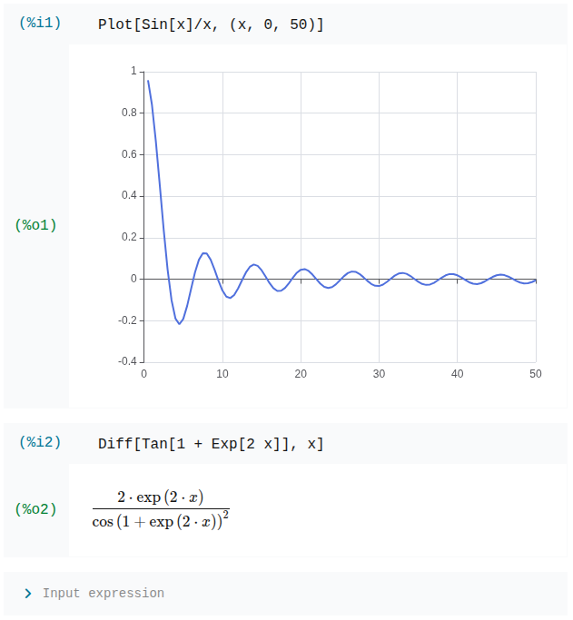

# A toy CAS in Rust

This project emerged from my PDE solver where I experimented with WebGL and WebAssembly compiled from Rust. I took the basic implementation of the parser I implemented and made it a bit more robust. Furthermore, I added a (pretty naive) `BigInteger` and `Rational` implementation. For the AST, I implementated a first draft of a cannonicalization procedure, with constant folding and gathering terms with constant coefficients. From the AST, Latex output can be generated.

## Demo

The project comes with a library that provides WASM bindings, which allows one to embed the CAS in a website. To try it out, visit [the demo website](https://kercle.github.io/cassidinae/).

Example screenshot of the web app demonstrating plotting and differentiation:


## Design goals

Since this is just a toy project of mine, I want to keep the core modules independent of external crates. For now the CLI tool links against the library. In the future, I'd like to have a dedicated kernel that a UI application can connect to.

## Syntax

The syntax of the expressions is Mathematica inspired.

```
<cmp> ::= <sum> { ("<"|"<="|"=="|">="|">") <sum> }*
<sum> ::= <product> { ("+"|"-") <product> }*
<product> ::= <signed_power> { ("*"|"/") <signed_power> }*
<signed_power> ::= { "+" | "-" }* <power>
<power> ::= <atom> { "^" <power> }
<atom> ::= <number> 
   | <symbol_or_function_call>
   | <string_literal> | "(" <sum> ")"
<symbol_or_function_call> ::= <identifier_or_pattern>
   | <identifier_or_pattern> "[" "]"
   | <identifier_or_pattern> "[" <expression> { "," <expression> }* "]"
```

## Builtin functionality

- `D[f, x]` gives the derivative of `f` wrt. `x` where `x` needs to by a symbol.
- `Integrate[f, x]` gives the anto-derivative of `f` wrt. `x` where `x` needs to by a symbol. For now I just built the framework for integrating RUBI ones the pattern matching engine is mature enough. I will look into the Risch algorithm later.
- `Blank[]` and `Blank[HeadConstraint]` for matching expressions.
- `BlankSeq[]` for matching sequences of expressions (at least one element).
- `BlankNullSeq[]` analogous to `BlankSeq` but may also match no elements.
- `Pattern[x, p]` binds the pattern `p` to `x`.
- `PatternTest[p, pred]` Evaluates the predicate `pred` on the pattern `p`. Currently supports: `IsSymbol`, `IsNumber`, `IsInteger`, `IsRational`, `IsPositive`, `IsNegative`
- `Plot[f[x], x, x0, x1]` for plotting `f[x]`. It is still a very early-prototype implementation and the signature of the plot pattern will align more with the Mathematica syntax.

## Goals

- [x] Decouple `AstNode` from internal `Expr`
- [x] Basic Pattern matching
- [x] More advanced Pattern matching (commutative expressions with at most one sequence)
- [x] Make Expr into Merkle tree for quicker pattern matching
- [x] Remove annotation from Expr, as the intended use case was solved differently
- [ ] Allow more sequences in commutative patterns
- [ ] Support for more flexible predicate in pattern matching
- [ ] Rework normalization to make it both more efficient and maintainable
- [x] Basic Rewrite engine
- [ ] Basic polynomial engine
- [ ] Solve polynomial equations
- [x] Naive Differentiation
- [x] Naive Integration with simple rules
- [ ] More advanced integration
- [ ] Matrix/Vector operations
- [ ] Numerical evaluation and dynamical variables for dashboards
- [ ] Numerical integration and ODE/PDE solving
- [ ] Numerical solver for equations
- [ ] UI maybe with Tauri
- [x] Web frontend built with Svelte
- [ ] Compile to Web-Assembly and bundle with frontend

## Logo

The logo features a tortoise beetle. Initially my inspiration is comming from [SerenityOS](https://serenityos.org) with its ladybug logo. I looks for beetles featuring pretty patterns and then tortoise beetles shows up. Coincidentally, the subfamily is also called *Cassidinae*, which - starting with CAS - was the perfect match. 🙂

## Disclaimer on use of AI

A lot of the test cases where generated using Claude.
